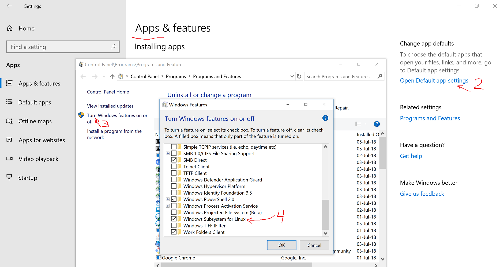

# The Basics

## Node 8.x

* Install build tools for windows (required for compiling native packages): 

`npm install --global --production windows-build-tools`
_... it will take some time_

## Git for Windows
[Download](https://git-scm.com/download/win)

(Installation options)

### .gitconfig
```
[user]
	name = hbenmich
	email = hbenmich@cisco.com
[core]
	autocrlf = false
	excludesfile = C:\\Users\\hbenmich\\Documents\\gitignore_global.txt
[difftool "sourcetree"]
	cmd = 'C:/Program Files (x86)/WinMerge/WinMergeU.exe' \"$LOCAL\" \"$REMOTE\"
[alias]
	hist = log --pretty=format:\"%h %ad | %s [%an]\" --graph --date=short
[credential]
	helper = manager
```

## VSCode

### Configuration Settings

My User Settings:

```json
{
    "eslint.autoFixOnSave": true,
    "files.eol": "\n",
    "terminal.integrated.shell.windows": "C:\\WINDOWS\\System32\\cmd.exe",
    "git.autofetch": true,
    "terminal.integrated.rendererType": "dom",
    "window.zoomLevel": 0
}
```

### Extensions

* npm Intellisense
* Docker (syntax highlighting)
* ESLint, see files in the `resources` directory:
  * [.eslintignore](resources/.eslintignore)
  * [.eslintrc.json](resources/.eslintrc.json)
* vscode-language-todo
* Python

... Should probably look at 'prettier'


## Ubuntu on WSL (Windows Subsystem for Linux)

1. Enable WSL
Settings->Apps->Open Default app settings->Turn Windows features on or off->Windows Subsystem for Linux

2. Install Ubuntu from Windows Store
3. Setup wsl.conf to mount 'c' drive under root
	```bash
	[automount]
	enabled = true
	root = /
	options = "metadata,umask=22,fmask=11"
	mountFsTab = false
	```
#### Optionally install ...

* Install "rpm" package on Ubuntu. This will allow you to build RPMs on Ubuntu.
`sudo apt-get install rpm`
* Install Node: https://github.com/nodesource/distributions/blob/master/README.md#debinstall

## Docker for Windows

* [Direct link](https://download.docker.com/win/stable/Docker%20for%20Windows%20Installer.exe)	
* [From Web Page](https://store.docker.com/editions/community/docker-ce-desktop-windows)
	* * I recommend __not__ using the "Edge" installation, only use "stable" builds. I had a lot of problems with "Edge".
* [Setting Up Docker for Windows and WSL to Work Flawlessly _from May 8, 2018_](https://nickjanetakis.com/blog/setting-up-docker-for-windows-and-wsl-to-work-flawlessly)

Follow instructions there, when you get to the section __Install Docker within WSL__ run the script [resources/setupDockerOnWsl.sh](resources/setupDockerOnWsl.sh)

#### Difference in script from what is found in Nick's article

* Using "stable" instead of "edge"
* Upgraded Docker-compose version from 1.21 to 1.22
* Appended command to add docker host to end of the script

:+1: nickjanetakis

# Other tools I Use

* Winmerge
* Python
	* crypto
* Vagrant+VirtualBox
* IHMonitor (+MoboXterm)
* Putty
* 7zip
